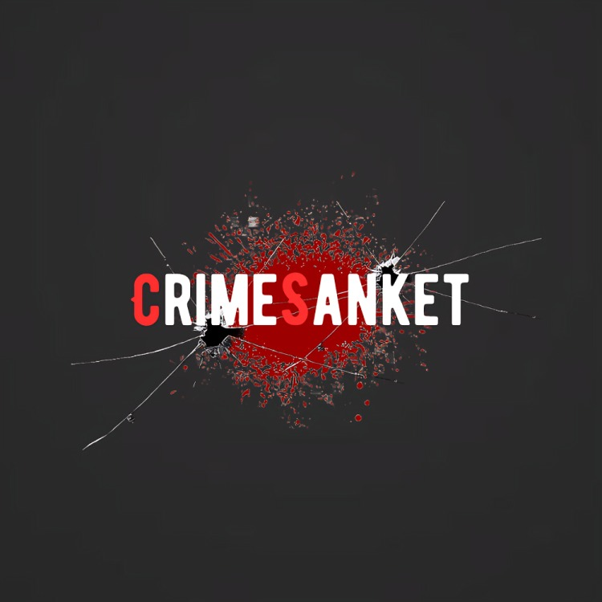
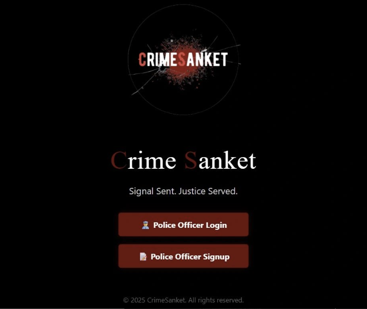
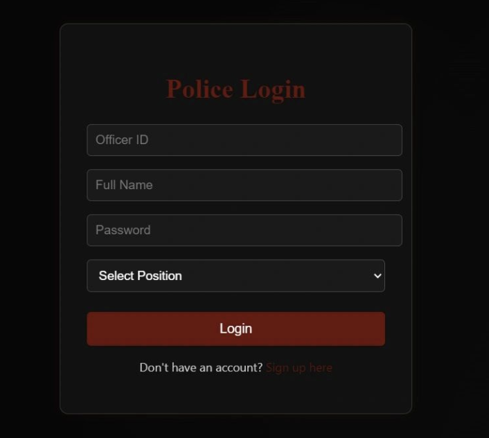
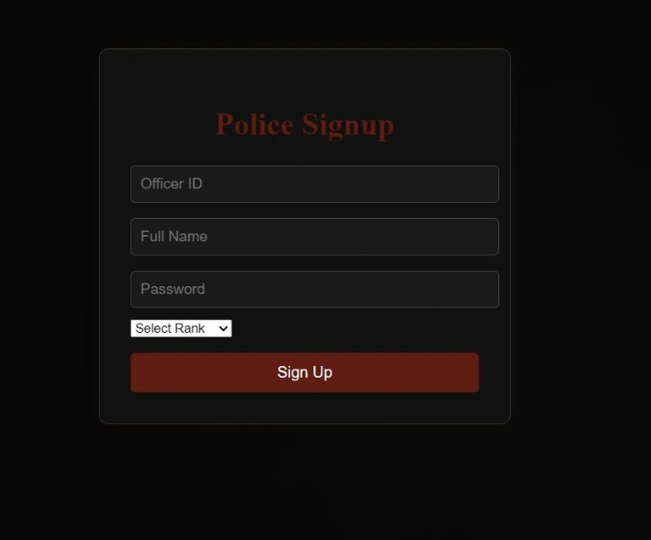
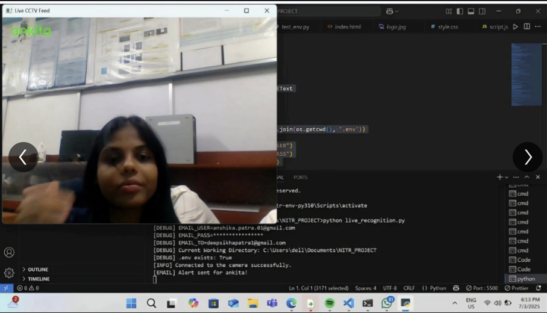

# CrimeSanket
# 🚨 CrimeSanket

<p align="center">
  
</p>

<h3 align="center">
AI-Powered Real-Time Criminal Detection & Management System
</h3>

<p align="center">
An intelligent surveillance system that detects known criminals in real-time using AI-powered facial recognition and automatically alerts law enforcement authorities with live location and evidence.
</p>

---

## 📌 About the Project

CrimeSanket is an AI-powered **Real-Time Criminal Detection & Management System** developed during the **AI & IoT Internship at the National Institute of Technology (NIT) Rourkela**.

The project combines **Artificial Intelligence, Computer Vision, Database Management, and Web Technologies** to create a smart surveillance solution capable of identifying known criminals from live CCTV feeds.

Using **DeepFace** for face recognition and **OpenCV** for real-time video processing, the system compares detected faces against a criminal database. Whenever a known criminal is identified, CrimeSanket automatically:

- Detects the face in real time
- Matches it with the criminal database
- Retrieves criminal information
- Captures the live image
- Detects the current GPS location
- Sends an automated email alert to the concerned police authority
- Displays the criminal profile through an interactive web dashboard

The objective of this project is to demonstrate how Artificial Intelligence can assist law enforcement agencies by enabling faster identification, real-time monitoring, and quicker response to criminal activities.

---

# ✨ Key Features

### 🎥 Real-Time Face Detection
- Detects faces from live CCTV/Webcam feed.
- Performs continuous monitoring.
- Supports real-time processing.

---

### 🧠 AI Face Recognition
- Uses **DeepFace** for facial recognition.
- Matches captured faces with stored criminal records.
- Generates confidence-based recognition.

---

### 🗄 Criminal Database
- Secure MySQL database.
- Stores criminal information.
- Stores facial images.
- Maintains criminal history.

---

### 📧 Automatic Email Alerts
Whenever a criminal is detected, the system automatically sends an email containing:

- Criminal Name
- Date & Time
- Live Captured Image
- Database Match Image
- GPS Coordinates
- Current Location

---

### 📍 Live Location Tracking

The system detects the suspect's location and provides:

- Latitude
- Longitude
- Approximate Address
- Location displayed on map

---

### 👮 Police Authentication

Dedicated Police Portal providing:

- Officer Registration
- Officer Login
- Secure Authentication

---

### 📊 Criminal Profile Dashboard

Displays:

- Criminal Name
- Criminal ID
- Crime History
- Last Seen Time
- Last Seen Location
- Current Surveillance Status
- Interactive Map

---

### 🌐 Web-Based Interface

Modern user-friendly interface developed for law enforcement authorities to:

- Login securely
- View criminal information
- Access surveillance records
- Manage database

---

# 🎯 Objectives

The primary objectives of CrimeSanket are:

- Improve criminal identification using Artificial Intelligence.
- Reduce manual surveillance efforts.
- Enable real-time criminal detection.
- Assist police with instant alerts.
- Improve public safety through smart surveillance.
- Demonstrate AI applications in law enforcement.

---

# 🧠 AI Workflow

```text
                CCTV Camera
                     │
                     ▼
           Face Detection (OpenCV)
                     │
                     ▼
      Face Recognition (DeepFace)
                     │
                     ▼
      Compare with Criminal Database
                     │
          ┌──────────┴──────────┐
          │                     │
       No Match             Match Found
          │                     │
          ▼                     ▼
 Continue Monitoring     Fetch Criminal Details
                                │
                                ▼
                      Capture Current Image
                                │
                                ▼
                        Detect GPS Location
                                │
                                ▼
                    Generate Email Notification
                                │
                                ▼
                     Notify Police Authorities
                                │
                                ▼
                     Update Criminal Dashboard
```

---

# 🛠 Technology Stack

## Programming Languages

- Python
- JavaScript
- HTML5
- CSS3

---

## Artificial Intelligence

- DeepFace
- Face Recognition
- OpenCV

---

## Backend

- Flask
- Node.js

---

## Frontend

- HTML
- CSS
- JavaScript

---

## Database

- MySQL

---

## Additional Libraries

- python-dotenv
- geocoder
- mysql-connector-python

---

# 🚀 Core Functionalities

✅ Live Criminal Detection

✅ Face Recognition

✅ Criminal Database Management

✅ GPS Location Tracking

✅ Automated Email Alerts

✅ Police Authentication

✅ Criminal Profile Dashboard

✅ Interactive Map

✅ AI-Based Surveillance

✅ Database Integration

---

# 📸 Project Demonstration
## 🖼 Application Screenshots

### 🏠 Home Page

The landing page provides a secure entry point for police officers to access the CrimeSanket platform.

<p align="center">

</p>

---

### 🔐 Police Login

Authorized officers can securely log in to access the criminal management dashboard.

<p align="center">

</p>

---

### 📝 Police Registration

New police personnel can register themselves before accessing the system.

<p align="center">

</p>

---

### 🕵 Criminal Profile Dashboard

Displays detailed criminal information including identity, crime history, surveillance status, and last known location on an interactive map.

<p align="center">

</p>

---

### 🎥 Live Face Recognition

The AI engine continuously monitors the CCTV feed and compares detected faces with the criminal database in real time.

<p align="center">

</p>

---

### 📧 Automated Email Alert

When a criminal is detected, the system automatically sends an alert email with the captured image, matched database image, timestamp, and GPS location.

<p align="center">

</p>

---

# 📂 Project Structure

```text
CrimeSanket/
│
├── frontend/
│   ├── app.py
│   ├── config/
│   ├── controllers/
│   ├── routes/
│   ├── views/
│   ├── Public/
│   ├── data/
│   ├── images/
│   └── package.json
│
├── backend/
│   ├── live_recognition.py
│   ├── encode_faces.py
│   ├── fetch_criminal.py
│   ├── criminal_photos/
│   └── .env (Not Included)
│
├── database/
│   ├── SQL Scripts
│   ├── ER Diagram
│   └── Database Schema
│
├── assets/
│
├── requirements.txt
├── .gitignore
├── LICENSE
└── README.md
```

---

# ⚙ Installation Guide

## 1️⃣ Clone the Repository

```bash
git clone https://github.com/Deepsikha2003/CrimeSanket.git
```

---

## 2️⃣ Navigate to the Project

```bash
cd CrimeSanket
```

---

## 3️⃣ Install Python Dependencies

```bash
pip install -r requirements.txt
```

---

## 4️⃣ Install Node Dependencies

```bash
npm install
```

---

## 5️⃣ Configure Environment Variables

Create a `.env` file inside the backend directory and configure the following:

```env
EMAIL_USER=your_email
EMAIL_PASS=your_password

MYSQL_HOST=localhost
MYSQL_USER=root
MYSQL_PASSWORD=your_password
MYSQL_DATABASE=crimesanket
```

> **Note:** The `.env` file has been excluded from this repository for security purposes.

---

## 6️⃣ Import the Database

Open MySQL Workbench and execute the SQL scripts available inside the **database** folder.

---

## 7️⃣ Run the Flask Application

```bash
python app.py
```

---

## 8️⃣ Start the Face Recognition Engine

```bash
python live_recognition.py
```

---

# 📧 Email Alert Workflow

Whenever the AI system recognizes a known criminal:

1. Face is detected using OpenCV.
2. DeepFace matches the face with the criminal database.
3. Criminal details are retrieved.
4. Current image is captured.
5. GPS location is detected.
6. Email alert is generated automatically.
7. Police authorities receive:
   - Criminal Name
   - Captured Image
   - Database Image
   - Time of Detection
   - GPS Coordinates
   - Location

---

# 🗺 Criminal Tracking

CrimeSanket also provides an interactive map displaying the last known location of the detected criminal.

Information displayed includes:

- Criminal Name
- Criminal ID
- Last Seen Date
- Last Seen Time
- Last Known Address
- Latitude
- Longitude
- Surveillance Status

---

# 💡 Highlights

- 🎯 AI-powered criminal detection
- 🎯 Real-time surveillance
- 🎯 Automated police notification
- 🎯 Face recognition using DeepFace
- 🎯 Live webcam/CCTV integration
- 🎯 MySQL database integration
- 🎯 Flask-based web application
- 🎯 Interactive criminal dashboard
- 🎯 GPS-enabled location tracking
- 🎯 Email automation

The following screenshots demonstrate different modules of the CrimeSanket system.

---

# 👥 Contributors

This project was developed as a collaborative team effort during the **AI & IoT Internship at the National Institute of Technology (NIT) Rourkela**.

| Name | Contribution |
|------|--------------|
| **Deepsikha Patra** | AI Development, Web Application Development, Database Integration, Documentation |
| **Anshika Patra** | Frontend Development, UI Design |
| **Murrire Thembikosi Emmanuel** | Backend Development |
| **Srujan Kumar Nayak** | Database Design & Integration |
| **Pritam Padhi** | Testing & System Integration |
| **Ankita Pattanaik** | Documentation & Project Support |

---

# 🌟 Future Enhancements

CrimeSanket can be further enhanced with the following features:

- 📱 Android & iOS Mobile Application
- ☁ Cloud Deployment
- 🎥 Multiple CCTV Camera Support
- 🤖 Improved AI Model Accuracy
- 📊 Criminal Analytics Dashboard
- 🔔 SMS Notifications
- 📍 Real-Time GPS Tracking
- 🌐 REST API Integration
- 🔒 Role-Based Access Control
- ☁ Cloud Database Integration
- 🧠 Criminal Behavior Prediction using Machine Learning
- 🛰 Drone Surveillance Integration

---

# 🔒 Privacy & Security

CrimeSanket has been developed for **educational and research purposes**.

The project follows several security practices:

- Environment variables are stored separately using `.env`
- Email credentials are excluded from the repository
- Database credentials are not publicly shared
- Sensitive files are ignored using `.gitignore`

---

# 📊 Technologies Used

| Category | Technologies |
|-----------|--------------|
| Programming Languages | Python, JavaScript, HTML5, CSS3 |
| Framework | Flask |
| AI & Computer Vision | DeepFace, OpenCV |
| Database | MySQL |
| Backend | Node.js |
| Version Control | Git, GitHub |
| Development Tools | VS Code, MySQL Workbench |

---

# 📚 Learning Outcomes

Through this project, we gained practical experience in:

- Artificial Intelligence
- Computer Vision
- Face Recognition
- Flask Web Development
- Database Management
- REST-based Application Development
- Email Automation
- Real-Time Surveillance Systems
- Team Collaboration
- Git & GitHub

---

# 🙏 Acknowledgements

We sincerely express our gratitude to:

- **National Institute of Technology (NIT) Rourkela** for providing the opportunity to work on this project during the AI & IoT Internship.
- Our mentors and coordinators for their continuous guidance and support.
- The open-source community behind **DeepFace**, **OpenCV**, **Flask**, and **MySQL** for making this project possible.

---

# 📄 License

This project is licensed under the **MIT License**.

Feel free to use, modify, and distribute this project while giving appropriate credit to the original authors.

---

# ⚠ Disclaimer

This project was developed solely for **educational, academic, and research purposes** as part of an internship program.

It is intended to demonstrate the application of Artificial Intelligence, Computer Vision, and Web Technologies in the domain of criminal detection and management.

The authors do not encourage or endorse unauthorized surveillance or misuse of facial recognition technology.

---

# 📬 Contact

**Deepsikha Patra**

📧 Email: deepsikhapatra1@gmail.com

💼 LinkedIn: https://www.linkedin.com/in/deepsikha-patra

🐙 GitHub: https://github.com/Deepsikha2003

---

# ⭐ If you found this project interesting...

If you like this project, please consider giving it a ⭐ on GitHub.

Your support is greatly appreciated!

---

<p align="center">

## 🚨 CrimeSanket

### *"Leveraging Artificial Intelligence for Smarter and Safer Communities."*

**Developed with ❤️ during the AI & IoT Internship at NIT Rourkela**

</p>

